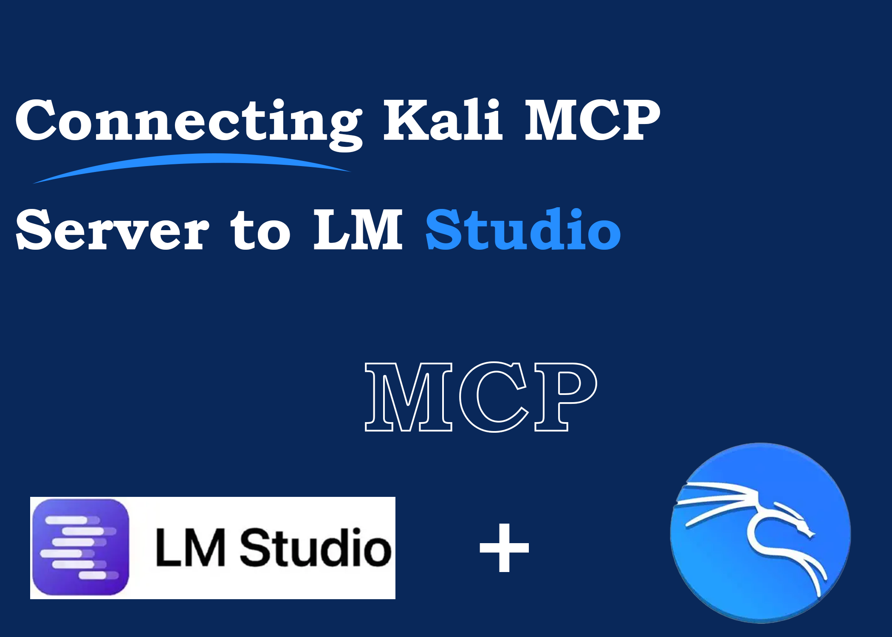
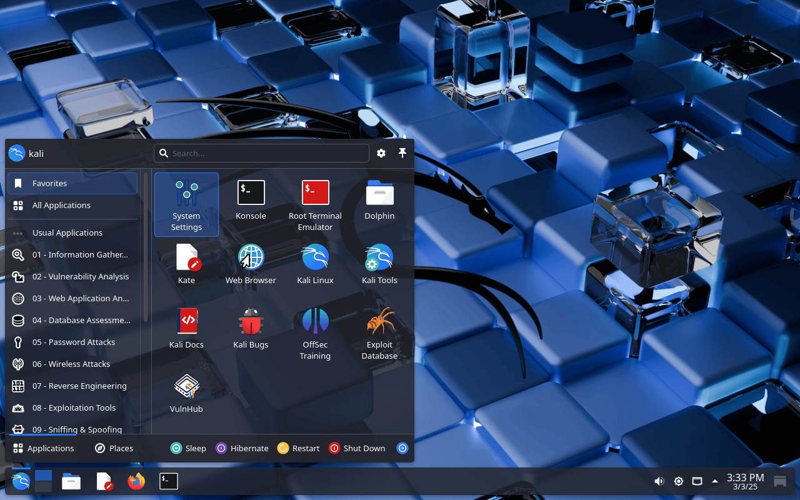

# How I Connected Kali MCP Server to LM Studio to Run AI Models


<br><br>


I recently discovered a way to connect my Kali MCP server to LM Studio, enabling me to run AI models directly from Kali. Here’s a step-by-step guide on how I did it.

---

## Step 1: Install the MCP Kali Server

First, open your terminal and install the Kali MCP server package:

```bash
sudo apt install mcp-kali-server
